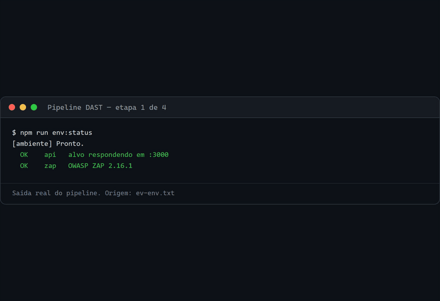
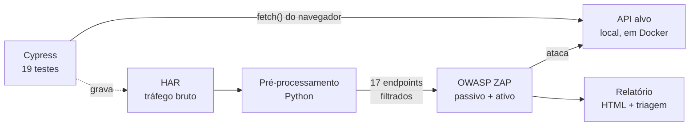
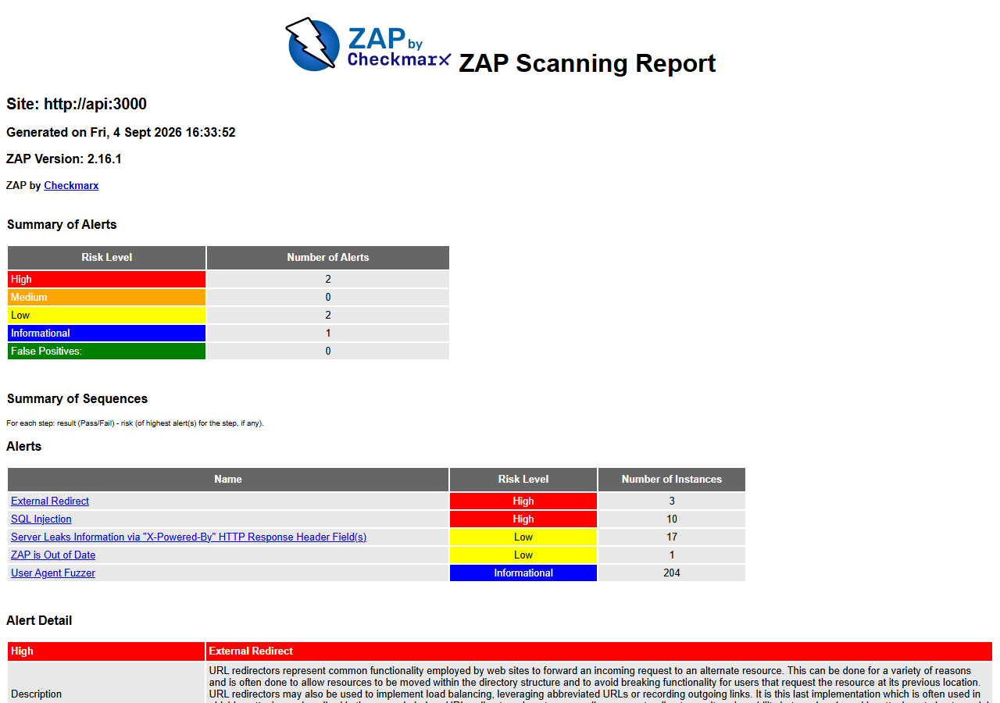

# DAST Pipeline — Cypress + OWASP ZAP

### Os testes que você já escreveu podem virar um scan de segurança

Este pipeline captura o tráfego HTTP que os testes **Cypress** produzem, trata
esse tráfego e o entrega ao **OWASP ZAP** como mapa de ataque. Nenhum endpoint
precisa ser catalogado à mão: o que os testes exercitam é exatamente o que o
scanner ataca.

[](https://github.com/MarcosQuintino0/dast-pipeline-cypress-zap/actions/workflows/pipeline.yml)
[](https://cypress.io)
[](https://www.zaproxy.org)
[](https://python.org)
[](https://docs.docker.com/compose/)
[](LICENSE)



---

## Resultados

|                                               |                                         |
| --------------------------------------------- | --------------------------------------- |
| **19 testes Cypress** geram o tráfego         | 7 segundos                              |
| **17 endpoints** entregues ao scanner         | GET, POST, PUT e DELETE                 |
| **235 alertas** encontrados pelo ZAP          | 2 de severidade alta                    |
| **2 achados altos triados com prova**         | 1 falso positivo, 1 real                |
| **44 testes unitários** no código do pipeline | cobrem o filtro que decide o que atacar |
| **6 defeitos corrigidos** no projeto de base  | 5 deles silenciosos                     |

Um scan completo leva cerca de **10 minutos** e roda inteiro na sua máquina,
contra um alvo que sobe junto do projeto.

---

## O problema

A maioria dos projetos trata qualidade funcional e segurança como trilhos
separados. Os testes E2E rodam no pipeline; o teste de segurança acontece uma
vez por trimestre, com alguém apontando um scanner para a aplicação e
catalogando endpoints na mão.

Isso tem dois custos. O catálogo de endpoints **envelhece** — some um, nasce
outro, ninguém atualiza. E o scanner **não sabe usar a aplicação**: não tem
sessão autenticada, não conhece o payload válido, não sabe a ordem das chamadas.

## A solução

Os testes funcionais já sabem tudo isso. Eles autenticam, montam payloads
válidos e percorrem os fluxos na ordem certa. O tráfego que produzem é, por
construção, um mapa atualizado da API.

Este projeto captura esse tráfego e o transforma em entrada para o scanner.



O detalhe que faz o mecanismo funcionar: os testes usam **`fetch()` do
navegador**, e não `cy.request()`. O `cy.request()` sai do processo Node do
Cypress e nunca passa pelo navegador, então não aparece no HAR — o pipeline
inteiro ficaria sem tráfego para analisar.

---

## O achado principal

O scan encontrou **2 alertas de severidade alta**. Um é falso positivo, o outro
é real, e **ambos foram verificados fora da ferramenta**.



### SQL Injection — falso positivo

O ZAP acusou injeção de SQL no cabeçalho `Accept`, com o campo de evidência
**vazio**. Três coisas não fechavam: um cabeçalho de negociação de conteúdo não
costuma alimentar consulta a banco, evidência vazia indica detecção por
heurística, e o alvo persiste num arquivo JSON — **não tem banco SQL algum**.

Reproduzindo o payload e comparando as respostas por hash:

```
AND '1'='1'  →  c6f914455134791aead74569b7636d36
AND '1'='2'  →  c6f914455134791aead74569b7636d36
sem payload  →  c6f914455134791aead74569b7636d36
```

Idênticas. A detecção de injeção cega booleana compara a resposta de `'1'='1'`
com a de `'1'='2'`; quando a aplicação **ignora** o parâmetro, as duas ficam
iguais — e é essa igualdade que a heurística lê como condição sempre verdadeira.

### External Redirect — real

O cabeçalho `Host` é refletido, sem validação, nas URLs de paginação:

```bash
curl -H "Host: atacante.example" "http://localhost:3000/comments?_page=1"
```

```
Link: <http://atacante.example/comments?_page=2>; rel="next"
```

Um cliente que siga a paginação — comportamento correto segundo a RFC 8288 — é
conduzido a um host escolhido por quem fez a requisição. É a base do
envenenamento de cache web e do envenenamento de link de recuperação de senha.

**Ressalva:** nesta instância o risco concreto é baixo, porque não há cache
intermediário nem envio de e-mail. O que o achado demonstra é a classe do
defeito e a capacidade do pipeline de encontrá-la.

**A triagem completa, com os passos de reprodução, está em
[`docs/triagem-dos-achados.md`](docs/triagem-dos-achados.md).**

---

## O que este projeto demonstra

**Um scanner não entrega vulnerabilidades, entrega candidatos.** A parte que
exige engenheiro é separar risco real de ruído — e provar a diferença. Rodar a
ferramenta é o passo fácil.

**Segurança como etapa do pipeline, não como evento.** O scan roda no mesmo CI
que os testes funcionais, com o mesmo gatilho e o mesmo critério de falha.

**Tratar o tráfego antes de atacar.** O HAR bruto tem CSS, favicon, chamadas
internas do Cypress e dezenas de repetições. Entregar isso ao ZAP desperdiça
tempo de scan e gera falso positivo sobre recurso estático. O pré-processamento
valida, filtra por status e por método, deduplica por rota e tokeniza
identificadores: **24 requisições brutas viram 17 alvos limpos**.

**Testar a ferramenta de teste.** O módulo que decide o que será atacado tem 44
testes. Um erro ali não aparece como falha — aparece como relatório limpo,
porque o tráfego certo nunca chegou ao scanner.

---

## Segurança do próprio pipeline

Um scan ativo não lê: **ataca**. São centenas de payloads de injeção, traversal,
XSS e comando de sistema disparados contra cada endpoint. Apontar isso para
infraestrutura de terceiros é abuso e, em várias jurisdições, teste não
autorizado.

Daí três decisões:

**O alvo sobe com o projeto.** O `docker compose` levanta uma API local com a
forma do JSONPlaceholder. Você é o dono, o scan é legítimo por construção, e o
pipeline roda offline.

**Uma allowlist bloqueia o resto.** Antes de qualquer coisa tocar a rede, a fase
0 recusa alvo fora da lista:

```python
assert_target_is_allowed(settings.TARGET_URL)
```

**O padrão é seguro.** Nenhum caminho de configuração leva a um host externo por
omissão — esquecer uma variável não redireciona o ataque para fora.

---

## Stack

|                        |                                        |
| ---------------------- | -------------------------------------- |
| **Testes funcionais**  | Cypress 13, JavaScript                 |
| **Captura de tráfego** | `@neuralegion/cypress-har-generator`   |
| **Pipeline de dados**  | Python 3.11, Pydantic Settings, Loguru |
| **Scanner**            | OWASP ZAP 2.16 em modo daemon, via API |
| **Alvo**               | json-server, com dados determinísticos |
| **Ambiente**           | Docker Compose                         |
| **Qualidade**          | pytest, ruff, Prettier                 |
| **CI/CD**              | GitHub Actions                         |

---

## Como executar

Precisa de **Node 20+**, **Python 3.11+**, **Docker** e **Chrome**.

```bash
git clone https://github.com/MarcosQuintino0/dast-pipeline-cypress-zap.git
cd dast-pipeline-cypress-zap

npm ci
python -m venv .venv
source .venv/bin/activate          # Windows: .venv\Scripts\activate
pip install -r requirements.txt

cp .env.example .env
cp cypress.env.example.json cypress.env.json

npm run env:up                     # sobe a API alvo e o OWASP ZAP
npm run scan                       # Cypress → processamento → scan → relatório
```

O relatório sai em `security_tests/reports/`.

### Comandos

| Comando                | O que faz                                 |
| ---------------------- | ----------------------------------------- |
| `npm run env:up`       | Sobe alvo e ZAP, e espera ficarem prontos |
| `npm run env:status`   | Diagnóstico do ambiente                   |
| `npm run env:down`     | Derruba tudo                              |
| `npm run test:e2e`     | Só os testes Cypress                      |
| `npm run scan:process` | Só o processamento do HAR                 |
| `npm run scan:run`     | Só o scan do ZAP                          |
| `npm run scan`         | O pipeline completo                       |
| `npm run test:unit`    | Testes do código Python                   |
| `npm run lint`         | ruff                                      |

---

## Estrutura

```
cypress/
  e2e/tests/       5 specs, 19 testes que geram o tráfego
  support/         comandos, URLs e payloads centralizados

security_tests/
  cli/             os dois pontos de entrada do pipeline
  har/             filtra, deduplica, tokeniza e reescreve o HAR
  zap_scan/        contexto, política, execução e relatório do ZAP
  zap_scripts/     script HttpSender executado dentro do ZAP
  config.py        toda a configuração, validada por Pydantic

target/            a API alvo e o gerador do conjunto de dados
tests/             41 testes do código Python
docs/              triagem dos achados e evidências
```

---

## Três detalhes que resolvem problemas reais

**Tokenização de identificadores.** Durante o scan, o ZAP dispara centenas de
requisições contra o mesmo endpoint. Se todas usarem `userId: 1`, disputam o
mesmo registro e produzem conflito em vez de resultado. O pré-processamento
troca esses valores por `{{AUTO_INT}}`, e um script HttpSender rodando **dentro
do ZAP** substitui o token por um número novo a cada requisição.

**Allowlist de tecnologias.** O ZAP traz centenas de regras. Declarar que o alvo
é Node e Express desliga as de Oracle, IIS e PHP: menos tempo de scan e menos
falso positivo.

**Tradução de caminho entre host e container.** A API de importação do ZAP
recebe um caminho de arquivo e o abre no sistema de arquivos de quem executa o
ZAP. Como o ZAP roda em container e o HAR é gravado no host, o caminho precisa
ser traduzido — e o volume que faz a ponte está declarado no compose.

---

## O que foi corrigido em relação ao projeto de base

Este repositório parte de um projeto anterior de automação DAST. Colocá-lo para
rodar de ponta a ponta — na máquina e no CI — revelou seis defeitos, cinco deles
silenciosos:

| Defeito                                               | Consequência                                                   |
| ----------------------------------------------------- | -------------------------------------------------------------- |
| Regra de endpoint genérica vencia a específica        | `PUT` e `DELETE` **nunca eram escaneados**                     |
| Caminho de arquivo cruzando host e container          | Scan terminava com `exit 0` e **zero alertas**, sem ter rodado |
| Nome de contexto duplicado em dois módulos            | Scan quebrava na fase 6, após cinco fases bem-sucedidas        |
| Alvo padrão apontando para API pública                | Scan ativo contra infraestrutura de terceiros                  |
| Processamento do HAR encerrava com `exit 0` ao falhar | Passo verde no CI sobre um arquivo que nunca foi escrito       |
| Diretório do volume ausente no repositório            | Docker o criava como root e a gravação do HAR falhava no CI    |

O padrão se repete, e é o que torna o conjunto interessante: **um scan que não
rodou e um alvo sem vulnerabilidades produzem exatamente a mesma saída.** Só um
dos dois é boa notícia. Hoje cada etapa falha alto — importação recusada pelo
ZAP e processamento sem tráfego encerram o pipeline em vez de deixá-lo verde.

---

## Autor

**Marcos Quintino** — [github.com/MarcosQuintino0](https://github.com/MarcosQuintino0)

Licenciado sob [MIT](LICENSE).
